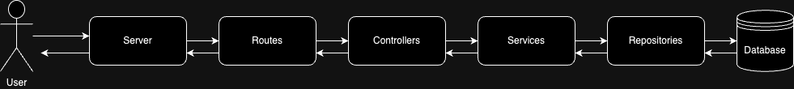

# Mercado Libre Challenge

Golang RESTful API using Fiber to solve "Operación Fuego de Quasar" problem


## Quick start

1. Clone the project.

2. Rename `.env.example` to `.env` and fill it with your environment values.

3. Run project:

   ```bash
   go run .
   ```

- *If you have air package for live reloading, run the project with:*

   ```bash
   air
   ```

## Project structure

```bash
.
├── docs
├── src
│   ├── constants
│   │   └── secret_constants.go
│   ├── controllers
│   │   ├── root_controllers.go
│   │   └── secret_controllers.go
│   ├── core
│   │   ├── database
│   │   │   └── redis.go
│   │   └── server.go
│   ├── middlewares
│   │   └── fiber_middlewares.go
│   ├── models
│   │   └── secret_models.go
│   ├── repositories
│   │   └── secret_repositoriy.go
│   ├── routes
│   │   ├── root_routes.go
│   │   └── secret_routes.go
│   ├── services
│   │   └── secret_services.go
│   └── utils
│       ├── geometry_utils.go
│       ├── number_utils.go
│       ├── secret_utils.go
│       └── string_utils.go
├── .air.toml
├── .gitignore
├── .env.example
├── go.mod
├── go.sum
├── main.go
└── README.md
```

## Data Flow



